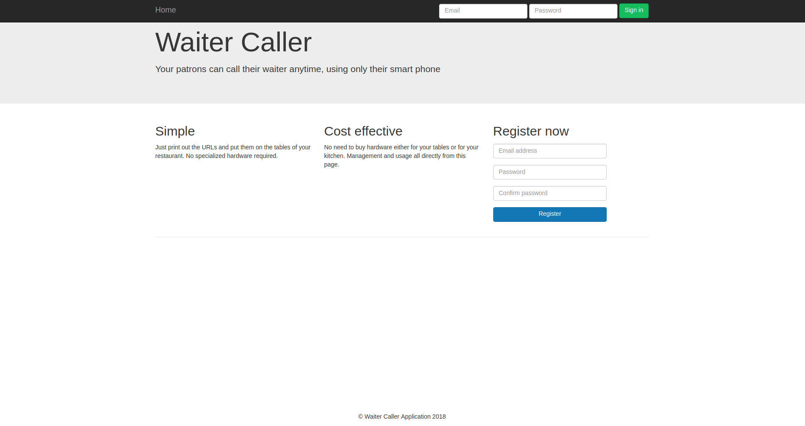
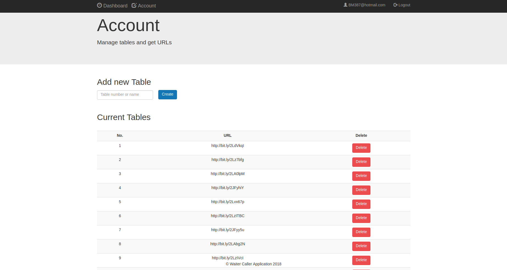
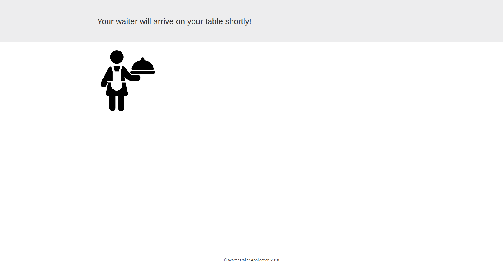
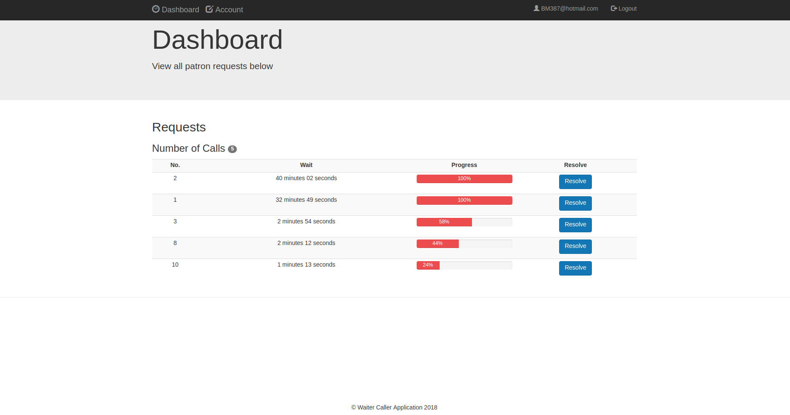

# Simple Waiter Calling App for Restaurant owners
Simple Waiter caller App that allows restaurant owners to use technology to know when their customers need a waiter. 
The restuarant owner places a small url on each table which a customer makes a request on to call a waiter. Each
request is logged on the dashboard that is visible to the restaurant owner. 
Below are screen shots of the application

<h2> Main login and registration page </h2>

  

<h2> Page for the owners to add tables and get short bitly links</h2>

  

<h2> View for the customers</h2>

  

<h2> Dashboard for the restaurant owners</h2>

  

Sources:
* Gareth Dwyer-Flask By Example_ Unleash the full potential of the Flask web framework by creating simple yet powerful web applications-Packt Publishing (2016)

